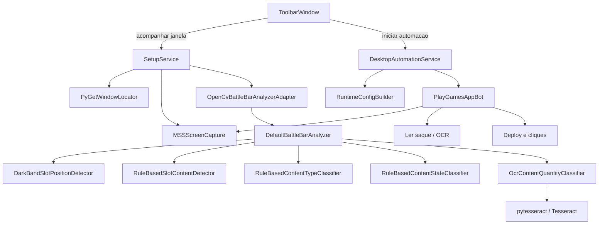
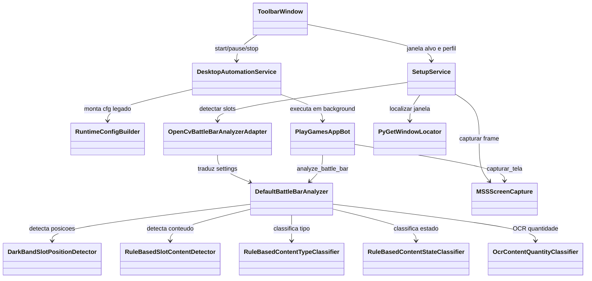

# Play Games App QA Visual Bot

Bot visual para testar app proprio/autorizado rodando no Google Play Games.
Ele trabalha por captura de tela, reconhecimento de botoes por imagem, OCR opcional e cliques configuraveis.

## Estrutura

```text
playgames_app_qa_visual_bot/
|- main.py
|- config.py
|- playgames_app_bot.py
|- calibrar_mouse.py
|- screenshot_grade.py
|- crop_asset.py
|- services/
|  \- automacao_service.py
|- clients/
|  \- window_client.py
|- tasks/
|  \- executar_fluxo.py
|- utils/
|  \- image_utils.py
|- assets/
|- config.example.yaml
|- config.yaml
```

- `main.py`: novo ponto de entrada principal.
- `config.py`: carregamento de YAML, merge de perfis CV e resolucao de caminhos.
- `services/`: regras e orquestracao do bot.
- `clients/`: integracao com a janela do Play Games.
- `tasks/`: fluxo executavel do bot.
- `utils/`: funcoes auxiliares de imagem.
- `playgames_app_bot.py`: wrapper de compatibilidade com o comando antigo.

## Instalacao

```cmd
python -m venv .venv
source .venv/Scripts/activate
pip install -r requirements.txt
copy config.example.yaml config.yaml
```

## Uso basico

Configure a janela no `config.yaml`:

```yaml
window:
  title_contains: "Google Play Games"
```

Comandos principais:

```cmd
python main.py --config config.yaml
python main.py --config config.yaml --cv cv_13
python main.py --config config.yaml --preliminary
python main.py --config config.yaml --deploy-now
python main.py --config config.yaml --cv cv_13_slot_calibration --battle-calibration
```

Compatibilidade:

```cmd
python playgames_app_bot.py --config config.yaml
```

Toolbar beta:

```cmd
python gui_main.py
```

O Clash of Clans precisa estar aberto antes da inicializacao. O app exibe apenas uma barra compacta sobre a area superior do jogo com:

- seletor `CV13`, `CV14` e `CV17`
- controles `Start`, `Pause` e `Stop`
- botao `Pin` para bloquear/desbloquear o arraste manual
- identificacao `Beta version 0.0.1`

A barra abre em primeiro plano e aparece normalmente na barra de tarefas do Windows. Ela recebe uma posicao inicial sobre o Clash, mas depois pode ser movida livremente pelo usuario e nao acompanha redimensionamentos do jogo. O botao `Pin` bloqueia a posicao atual. A aplicacao encerra quando a janela alvo for fechada.

O executavel desktop usa o `config.yaml` real incorporado ao build e sempre executa com cliques habilitados (`dry_run=false`). Os perfis CV13 e CV14 compartilham o mesmo roteiro atual; CV17 usa seu roteiro proprio.

`Pause` interrompe o ciclo no proximo checkpoint seguro. Depois que o status voltar para parado, um novo `Start` cria outra execucao e comeca novamente pelo primeiro passo, procurando o botao Atacar. O usuario deve retornar manualmente para a tela inicial antes de reiniciar.

## Como o app funciona hoje

O executavel nao fica classificando a tela em tempo real so por estar aberto. O comportamento atual e este:

- a `Toolbar` sobe vinculada a janela do Clash e consulta o estado do worker
- a automacao roda em background quando voce clica em `Iniciar`
- durante a automacao, o bot faz novas capturas de tela conforme o fluxo precisa localizar botoes, ler saque por OCR ou analisar a `battle_bar`

Fluxo simplificado:



## Estrutura atual

O desenho atual tem alguma separacao de responsabilidade, mas nao e um dominio muito puro. A UI desktop ficou razoavelmente separada; ja o bot principal ainda concentra comportamento em mixins e heuristicas visuais.



Leitura pragmatica da arquitetura:

- `ToolbarWindow` contem apenas controles, estado e acompanhamento da janela alvo.
- `SetupService` esta funcionando como fachada de captura e diagnostico para a UI.
- `DesktopAutomationService` so controla ciclo de vida do worker; isso esta ok.
- `RuntimeConfigBuilder` existe porque a UI nova ainda alimenta o bot legado.
- `PlayGamesAppBot` continua sendo a peca mais acoplada. Ele agrega fluxo, OCR, deploy, janela e battle bar por mixins.
- `DefaultBattleBarAnalyzer` ja parece uma pipeline melhor definida: detectar posicao, detectar conteudo, classificar tipo, classificar estado, rodar OCR de quantidade.

## Onde a deteccao ainda e fraca

Os pontos mais frageis hoje nao estao no Tesseract em si, e sim antes dele:

- a segmentacao dos slots ainda depende de heuristicas de `dark band`, anchors internos e rebalance de largura
- a classificacao de tipo e estado ainda e majoritariamente baseada em regras visuais simples, nao em identificacao robusta do card
- o OCR de quantidade funciona melhor quando o slot ja veio bem recortado; se a divisao entre cards estiver ruim, o Tesseract herda o erro
- existe acoplamento entre layout esperado e heuristicas da `battle_bar`, o que torna mudancas de skin/layout mais sensiveis

Em resumo: o pipeline atual e suficiente para experimentar e iterar, mas a deteccao ainda esta mais para heuristica calibrada do que para segmentacao robusta.

## Melhor direcao para evoluir

Se a meta for melhorar a confiabilidade da `battle_bar`, a ordem mais defensavel e:

1. fortalecer a segmentacao fisica dos cards
2. estabilizar as sub-ROIs de quantidade e badge
3. so depois refinar OCR e classificacao semantica

Na pratica, isso significa priorizar:

- detectar melhor as fronteiras entre cards
- tratar moldura/topo do card como sinal estrutural
- reduzir dependencia de largura fixa presumida
- separar melhor `detector de slot` de `classificador do slot`

## Gerar EXE

No Git Bash, ative o ambiente e rode:

```bash
source .venv/Scripts/activate
./build_desktop_app.sh
```

O build converte automaticamente `assets/app_icon.png` em um ICO multirresolucao e aplica o icone ao executavel. O PNG deve ser quadrado e ter pelo menos `256x256`; recomenda-se `512x512` ou maior.

O arquivo gerado em `dist/playgames-bot-desktop.exe` e autocontido: inclui a configuracao dos ataques, assets visuais e o runtime local do Tesseract. Nao e necessario distribuir `config.yaml`, `assets/` ou `runtime/` separadamente.

## Tesseract embutido

Para distribuir o OCR via `pytesseract` sem depender de instalacao manual no Windows, coloque o binario do Tesseract em:

```text
runtime/tesseract/tesseract.exe
runtime/tesseract/tessdata/eng.traineddata
```

O build desktop inclui essa pasta automaticamente quando ela existir, e o app passa a resolver `vision.tesseract_cmd` para `runtime/tesseract/tesseract.exe`.

## Utilitarios

Descobrir coordenadas relativas:

```cmd
python calibrar_mouse.py --config config.yaml
```

Gerar screenshot com grade:

```cmd
python screenshot_grade.py --config config.yaml
```

Recortar asset:

```cmd
python crop_asset.py --input debug_saida\screenshot_grade_20260602-120000.png --output assets\start_button.png --x 100 --y 500 --w 150 --h 60
```

Diagnosticar OCR do Tesseract em uma imagem/ROI:

```cmd
python diagnose_ocr_image.py --image image.png --x 100 --y 120 --w 220 --h 70
```

O utilitario grava variantes preprocessadas e um `results.json` em `tmp/ocr_diagnostics/` para calibrar `psm_modes`, `upscale_factor`, `blur_kernel` e ROI.

## Assets e fluxo

No `config.yaml`, cada asset precisa existir em `assets:` com a mesma chave usada no fluxo:

```yaml
assets:
  start_button: "assets/start_button.png"
  start_button_2: "assets/start_button_2.png"
  search_button: "assets/search_button.png"
```

Fluxo inicial:

```yaml
flow:
  target_mode: direct_attack
  pre_search_steps:
    - start_button
    - start_button_2
    - search_button
```

O bot valida esses caminhos ao iniciar. Se algum asset estiver faltando, ele informa a chave e o caminho esperado.
